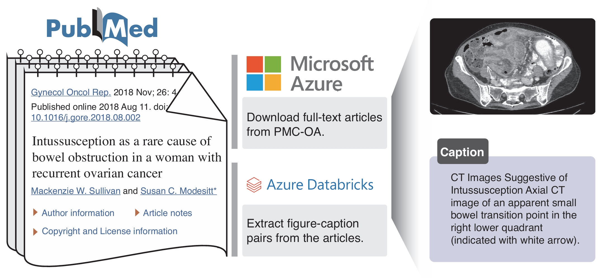

# BiomedCLIP Data Pipeline

[](LICENSE)

*A pipeline to construct millions of image-caption figures from PubMed.*

[[NEJM AI Article](https://ai.nejm.org/stoken/default+domain/9VPKUGJYJ5BPFXY83IBS/full?redirectUri=doi/full/10.1056/AIoa2400640)] 

**BiomedCLIP: a multimodal biomedical foundation model pretrained from fifteen million scientific image-text pairs** <br>

Sheng Zhang, Yanbo Xu, Naoto Usuyama, Hanwen Xu, Jaspreet Bagga, Robert Tinn, Sam Preston, Rajesh Rao, Mu Wei, Naveen Valluri, Cliff Wong, Andrea Tupini, Yu Wang, Matt Mazzola, Swadheen Shukla, Lars Liden, Jianfeng Gao, Angela Crabtree, Brian Piening, Carlo Bifulco, Matthew P. Lungren, Tristan Naumann, Sheng Wang, Hoifung Poon

<p align="center">
     <br>
</p>


This repository hosts the **BiomedCLIP Data Pipeline**, which automatically downloads and processes a set of articles from the PubMed Central Open Access dataset. The end result is a JSONL file containing figures and associated captions, which can be used to train the **BiomedCLIP** model.

For a hands-on demonstration, refer to the [example notebook](run_pmc15_pipeline.ipynb).


## Environment Setup 

```bash
# it is recmmended to use a virtual environment but not required
python -m venv .venv
source .venv/bin/activate

pip install -r requirements.txt
```

## Reference
```bibtex
@article{zhang2024biomedclip,
  title={A Multimodal Biomedical Foundation Model Trained from Fifteen Million Image–Text Pairs},
  author={Sheng Zhang and Yanbo Xu and Naoto Usuyama and Hanwen Xu and Jaspreet Bagga and Robert Tinn and Sam Preston and Rajesh Rao and Mu Wei and Naveen Valluri and Cliff Wong and Andrea Tupini and Yu Wang and Matt Mazzola and Swadheen Shukla and Lars Liden and Jianfeng Gao and Angela Crabtree and Brian Piening and Carlo Bifulco and Matthew P. Lungren and Tristan Naumann and Sheng Wang and Hoifung Poon},
  journal={NEJM AI},
  year={2024},
  volume={2},
  number={1},
  doi={10.1056/AIoa2400640},
  url={[https://ai.nejm.org/doi/full/10.1056/AIoa2400640](https://ai.nejm.org/doi/full/10.1056/AIoa2400640)}
}
```

## Contributing

This project welcomes contributions and suggestions.  Most contributions require you to agree to a
Contributor License Agreement (CLA) declaring that you have the right to, and actually do, grant us
the rights to use your contribution. For details, visit https://cla.opensource.microsoft.com.

When you submit a pull request, a CLA bot will automatically determine whether you need to provide
a CLA and decorate the PR appropriately (e.g., status check, comment). Simply follow the instructions
provided by the bot. You will only need to do this once across all repos using our CLA.

This project has adopted the [Microsoft Open Source Code of Conduct](https://opensource.microsoft.com/codeofconduct/).
For more information see the [Code of Conduct FAQ](https://opensource.microsoft.com/codeofconduct/faq/) or
contact [opencode@microsoft.com](mailto:opencode@microsoft.com) with any additional questions or comments.

## Trademarks

This project may contain trademarks or logos for projects, products, or services. Authorized use of Microsoft 
trademarks or logos is subject to and must follow 
[Microsoft's Trademark & Brand Guidelines](https://www.microsoft.com/en-us/legal/intellectualproperty/trademarks/usage/general).
Use of Microsoft trademarks or logos in modified versions of this project must not cause confusion or imply Microsoft sponsorship.
Any use of third-party trademarks or logos are subject to those third-party's policies.
